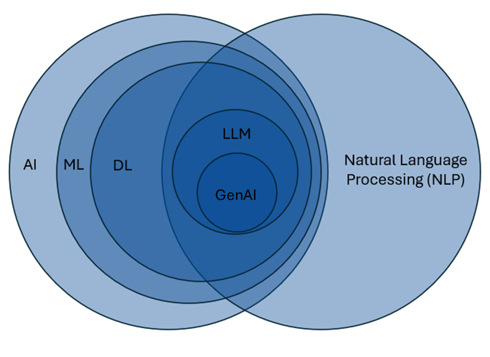

# Generative AI Fundamentals {#sec-gen-ai-fundamentals}

It is useful to learn some fundamental aspects of GenAI models prior to integrating them into your workflows. I have often found that many guides online tell you _how_ to use these models, but not _why_ you should do what they are telling you to do. Although the guidance given by these guides is often useful, when you do not get the output you want, it does not give you the skills to think critically about what might have gone wrong.

Even though generative AI models continue to demonstrate functional improvements without extensive prompt engineering, having some foundational knowledge of how these models work will serve you well when building your own generative AI workflows.

## What is Generative AI? 

{width=80% fig-align="center"}

So what _is_ generative artificial intelligence? 
We often hear the words GPT, generative AI, AI, LLM, and machine learning model used somewhat interchangeably, and that is not always necessarily the case.
Sometimes the speaker may not understand that they are referring to something they do not intend to refer to, and sometimes the technical specifics of what they are referring to do not quite matter.

In this diagram, I have attempted to show the relationship between Artificial Intelligence, Natural Language Processing, and many related fields, with Generative Artificial Intelligence in the middle.
The scale of the circles in this image is not accurate—I have only attempted to show the relationships among these fields.

Working from the left-hand side inward, our outermost circle is **Artificial Intelligence**, or AI. 
Artificial intelligence is the broad field of computer science focused on creating systems that can perform tasks typically requiring human intelligence, such as problem-solving, reasoning, and understanding language. 
I have heard some people argue that statistical models like regressions can be included in this large circle because you are learning about relationships in data that are not directly observable. 
I am not sure that I am convinced by this argument, but it does give you an idea of how broadly the field of AI can be construed. 

As we move inward, we next have **Machine Learning**. 
Machine learning is a subset of AI that involves using algorithms that learn patterns from data and improve their performance on tasks over time without being explicitly programmed for every possible scenario. In many machine learning approaches, the model identifies which patterns or features are useful for prediction from a large amount of available data.

This is different from a regression, where you typically specify the predictor variables of interest based on your knowledge of the domain. 
With many machine learning approaches, you instead supply a large set of potentially relevant variables and allow the algorithm to identify patterns that improve prediction. 
Here is where we start to encounter so-called “black box” models, because interpreting the decision-making processes of the algorithm can become difficult due to the complexity of the models.
One common example is when the values of some predictor variables take on complex nonlinear functional forms—how do we easily interpret this, especially if there are also complex interactions?

Going further inward, we have **Deep Learning**, which is a subset of machine learning models. 
These models reduce the need for manual feature engineering because they can learn useful representations from very large and varied datasets. 
Deep learning models use layered neural network architectures to identify complex patterns in data, and their results are often even less interpretable. 
Some deep learning models are trained in supervised ways, while others rely on unsupervised or self-supervised learning; in all cases, they are particularly useful when the relationships in the data are highly complex.
This is useful for things like speech and natural language, where relationships between variables are not always easily identified.

I will now jump to the right-hand side and the large field of **Natural Language Processing**. Broadly speaking, natural language processing is focused on enabling computers to understand and interpret human language. 
There are areas of NLP that do not overlap with machine learning or deep learning, such as rule-based language systems and some forms of text analysis.

If we look at the overlap between deep learning models and natural language processing models, we see that **Large Language Models** (LLMs) live here. 
LLMs represent a deep learning approach within NLP that leverages vast amounts of text data to generate and understand human-like language. 
These models go beyond many traditional NLP techniques by using statistical learning to predict and produce coherent, context-aware text at scale. 
Not all LLMs are generative AI models; some language models are designed primarily for tasks such as classification, embedding, or reranking rather than open-ended generation.

Now, finally, in the middle we have **Generative AI Models** (Gen AI). These are a specific type of model designed to generate new output that resembles patterns in their training data. The most common example is a generative text model, although models are now being developed that can also generate images, audio, and video.

## What is a Generative Pre-trained Transformer?

**Generative Pre-trained Transformers** (GPTs) are a type of generative AI model. 
While not all generative text models have "GPT" in their name, understanding their underlying structure can be helpful for learning how these models work.
Let us look at each letter in the acronym:

### Generative

The **G** in GPT stands for _generative_, which refers to the model's ability to generate new content based on patterns learned from its training data. 
This is similar to having a very large dataset and running a regression.
Based on the results, you have a good idea of the relationship between the predictor variables and the outcome.
Once you have this information, you can then make predictions on new cases that share the same predictor variables.
If the new case is well represented in your data, then your predictions will usually be fairly accurate.
However, if the new case is less well represented in your data, then you will likely have to extrapolate from your data to make the best guess you can, usually with large standard errors.

This kind of extrapolation beyond the training data is one way that generative AI models may hallucinate, or produce errors in their response, whether factual or structural.
While we are talking about training data...

### Pre-trained

Generative AI models undergo a vast amount of model pre-training (**P**). 
In a generative text model, this includes a vast corpus of text data. 
To give you an idea of how large this training data is, when I was first learning about these models, I often heard presenters say that some of these models were trained on all of the publicly available text on the _internet_. 
More recently, some researchers have argued that frontier models may be approaching the limits of the highest-quality publicly available text, which has helped drive growing interest in using synthetic data and refining training procedures to further improve model performance.
Having such a vast amount of data equips the model with a broad “understanding” of language and its nuances.
This understanding is really a recognition of patterns of word usage across many contexts.

It is important to note that these models are designed to generate content and do not have an inherent ability to verify the factual accuracy of the information they provide. 
If the training data contains extensive information related to the input, there is a higher probability that the output will be correct, but there is no guarantee.
When using text models, these systems are often generating one token at a time based on the patterns they have learned from prior text. 
There is no built-in self-reflective step in which the model evaluates whether the information being provided is factually accurate. 

### Transformer

And, finally, **T**—transformer. 
This refers to the specific neural network architecture that makes models like GPT so powerful. 
Before transformers were introduced, models processed language sequentially, one word at a time, which limited their ability to capture long-range context, understand ambiguities (e.g., pronoun referents, ambiguous negation, etc.), or parallelize computations efficiently. 
The transformer architecture revolutionized this process by allowing models to “pay attention” to all parts of a text at once. 
Attention helps the model determine which words, or tokens, are most relevant to predicting the next one ([we'll talk more about attention soon](07-gen-ai-basics.qmd#sec-attention)).

This design has two major advantages: it scales extremely well to large amounts of data, and it captures meaning flexibly across varying contexts. 
In other words, the transformer gives modern language models much of their power and fluidity.

[This blog post from the Financial Times](https://ig.ft.com/generative-ai/) is a great visual explanation of transformers and related concepts without being too technical.