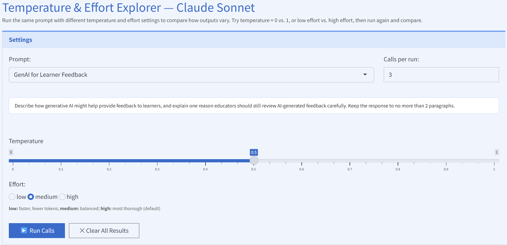

# Activity: Generation Parameter Testing

It will be useful to see how different generation parameters affect the output of LLMs.
To help you see how these parameters work, I built a simple online app[^1] (using [vibe coding](26-vibe-coding.qmd#sec-vibe-coding)) where you can select:

* One of 5 pre-written prompts
* A temperature (default = 0.5, the midpoint)
* The amount of effort (low, medium, or high)
* The number of times to send the prompt-temperature-effort combination to Claude Sonnet 4.6

It will take a few seconds for each replication, so keep an eye on the progress bar in the bottom-right corner.

Try out a prompt at different temperature and effort combinations.
The app retains all output until you manually clear it, so you can run the same prompt at multiple values, scroll up and down, and see how different generation parameters affect the output.
You can also set a higher number of replications (default is 3) to get a better sense of variation _within_ a given temperature-effort combination.

You can access the app here: [Temperature Testing App](https://nbme-research.shinyapps.io/temp-tester/)

{fig-align="center"}

[^1]: The app may not be functional outside of workshop hours in order to limit token costs. Please [email me](mailto:CRunyon@nbme.org) if it is offline and you would like me to temporarily turn it back on.