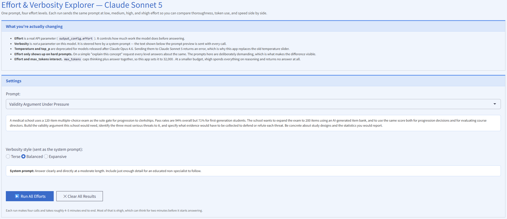

# Activity: Generation Parameter Testing

It will be useful to see how different generation settings affect the output of LLMs.
To help you see how they work, I built a simple online app[^1] (using [vibe coding](26-vibe-coding.qmd#sec-vibe-coding)) where you can select:

* One of 5 pre-written measurement and assessment prompts
* A verbosity style (Terse, Balanced, or Expansive)

Each run sends the selected prompt to Claude Sonnet 5 four times, once at each [effort](08-gen-ai-parameters.qmd#sec-reason-gen-params) level (`low`, `medium`, `high`, and `xhigh`).
The results appear side by side with the word count, output tokens, thinking tokens, and seconds for each effort level.

The two settings work differently:

* **Effort** is an actual API parameter. It controls how much work the model does before answering.
* **Verbosity** is _not_ an API parameter for this model. The app steers it with a [system prompt](08-gen-ai-parameters.qmd#sec-system-prompt), which is displayed beneath your selection so you can see exactly what is sent.

The prompts are deliberately difficult, multi-part reasoning tasks.
On a simple "explain this concept" request, every effort level produces roughly the same answer; harder prompts make the differences visible.

A full run takes several minutes, mostly because `xhigh` can reason for a few minutes before it starts answering, so keep an eye on the progress bar in the bottom-right corner.

Try the same prompt at different verbosity styles.
The app retains all output until you manually clear it, so you can scroll up and down and compare how effort and verbosity change the length, depth, cost, and speed of each response.

You can access the app here: [Effort & Verbosity Explorer](https://runyoncr-effort-explorer.share.connect.posit.cloud/)

{fig-align="center"}

[^1]: The app may not be functional outside of workshop hours in order to limit token costs. Please [email me](mailto:CRunyon@nbme.org) if it is offline and you would like me to temporarily turn it back on.