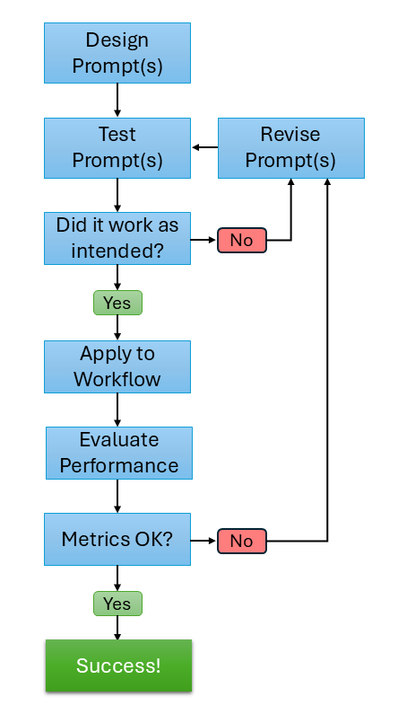
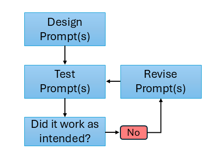
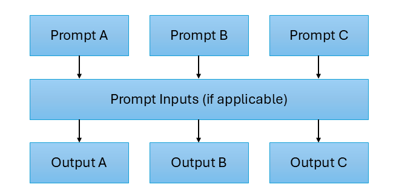
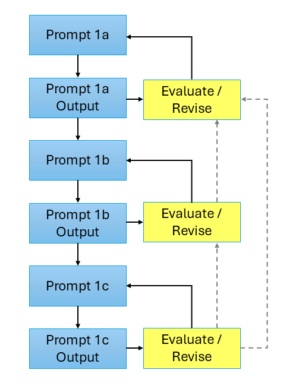
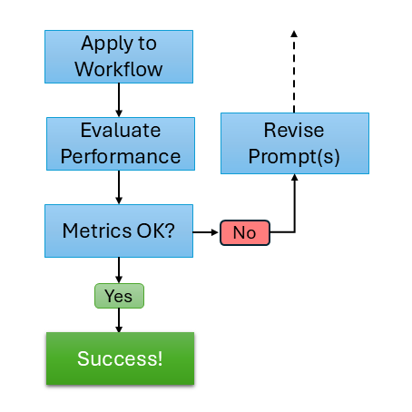

# Sample Workflow

It will be helpful to have a fully developed, high-level template of what an LLM-supported workflow in R might look like.
Subsequent sections will provide more detail on some of the individual components of the workflow, and having this initial workflow design will help structure that discussion.

One aspect of using LLMs to support your workflow is how that use ties into your **validity argument** framework. 
Although traditional validity frameworks were not developed when LLMs were ubiquitous and widely adopted, the same basic principles from these frameworks still apply.
There are at least two perspectives on integrating LLM workflows into validity frameworks:

1.  An Aspect of the Validity Argument

    The idea here is that the LLM workflow is part of the validity argument for _that specific part_ of the process, such as ensuring that generated content provides the appropriate stimulus or that LLM-derived scores support the intended score meaning.

2.  A Validity Argument Itself

    A stronger version posits that the _entire LLM workflow_ requires its own validity argument. Although computer science has its own evaluation metrics, the broader ecosystem of NLP/AI research does not necessarily share the same design considerations that we employ in educational measurement. There has been growing attention to the idea that an LLM-supported workflow should have its own validity argument.
    
I have made a somewhat artificial distinction here to emphasize what has already started to be more widely recognized: the work required for (1) often also requires (2). 
That is, you are likely incorporating an LLM-supported workflow into a larger process (e.g., scoring performance tasks at scale or developing content for a standardized test), so that workflow should have its own validity argument. 
*But* the component for which the LLM-supported workflow is used should _also_ have a validity argument of its own.

Here's the large diagram. More detail will be provided on the two main components below.

{fig-align="center" width=50%}

## Iterative Prompt Development

Prior to using an LLm in any workflow, it's (obviously) imperative to ensure that the prompt is doing what you want it to do.
This task should not be taken lightly, and significant time should be dedicated to this first step.
Analogs in traditional measurement tasks include data cleaning and wrangling before completing an analysis, or thoroughly testing your data-generation process for a simulation study.
Any issues not detected in this initial step will have downstream effects, so you want to mitigate that as much as possible.

These first tasks are in the top part of the diagram:

{fig-align="center"}

You start with an initial idea for a prompt, and then you should review and refine it multiple times before testing it.
This process involves ensuring that your prompt contains all of the necessary details to help ensure it's successful.
Most LLMs have evolved such that extensive prompt engineering isn't necessary, in the sense that these models now can have a generally good idea of what you want them to do, even if you don't phrase everything perfectly.
However, this does not mean that the model has the level of detail necessary to successfully carry out the task.
And, equally importantly, any important detail that is omitted the model will generate on its own, which may be problematic for specific tasks[^1].

The simple idea at the start of the workflow is: make a prompt &rarr; test it &rarr; see if the output of the prompt is good.
For example, if you're working on a content generation prompt, you'll want to work carefully on the prompt, apply it to a handful of different use cases (content areas, etc), and then look _across the different outputs_ what worked and what didn't.
It's hard to be able to identify nuanced shortcomings of model outputs if you're only testing the model on a subset of the conditions under which it'll be used (sound familiar?).
When you get a sub-optimal output, it also takes time to think about how to prevent that from happening again by reverse-engineering additional prompt instructions or adjustments. 
This reverse-engineering process is often what takes the most work for me - I think I know how to fix the issue, I implement a revision or add instructions, and it doesn't _quite_ do what I wanted it to do, so I have to do it again.
And, often times, again and again.
We'll practice this prompt engineering process [in an activity later.]()

**It should be expected that you will have to make some adjustments to your prompt.** 
This is not a shortcoming of your prompt engineering skills or the LLM; sometimes you just don't realize what some of the nuances of the prompt-output will produce.
Depending on the complexity of the prompt, I may have to revise anywhere from 3-20 times.

I should note that, depending on the nature of your prompt, having subject-matter experts (SMEs) involved in this process can be _extremely_ beneficial. 
For example, if you're using a prompt to generate content for a specific subject, having the same SMEs that you would trust with item writing involved in the initial prompt crafting can incredibly helpful.
While you bring rigorous measurement design expertise to the build, they bring the necessary content-relevant knowledge that can really help you develop a strong prompt.

When possible, and especially if you're working with a team, try to develop a set of candidate prompts for your workflow. 
These should include slightly different instructions and structure. 
Then test your prompts on the same set of candidate use cases, and see what worked well for some prompts, and what didn't work well in other prompts. 
Then, through the reverse-engineering process above, make a new Frankenstein prompt and see if it accomplishes what you want it to accomplish.
Visually, it might look like this:

{fig-align="center"}

### Sequential Prompt Development

When your prompt is complex - you're instructing the model to do several tasks within the same prompt - it can be beneficial to break these out into a series of smaller prompts.
For a ridiculous example, it's like asking a contractor to build you a house.
Sure, they can probably do it, but will the final product be what you want it to be?
What design decisions did the contractor make - e.g., how many bathrooms, bathroom locations, number of bedrooms, open-concept floorplan, etc.?
If you didn't specify these in your instructions, the contractor had to make these decisions on their own.

LLMs are the same way - anything that is important to complete the task that you don't specify, the model will have to generate on it's own.
This is especially important when there is a sequential or logical dependence between the output that you're developing, and it provides you with more flexibility to alter the workflow at different stages.

When using a sequential prompt workflow, the same evaluation for a single prompt generalizes to the multi-step prompts.
The only wrinkle is that sometimes when evaluating later prompts (e.g., 1c below) you can catch that you might need to change something in your initial prompt (1a) to help that output due to the sequential nature of the build.
Visually, it might look something like this:

{fig-align="center"}

## LLM Workflow Outcome Evaluation

The second part of the workflow comes after you've done the hard work of initial prompt refinement.
This is the fun part, much like finally running your analysis or starting your simulation study after the preliminary steps are completed.

{fig-align="center"}

This part of the workflow likely mirrors existing non-LLM-support processes in your workflow.
What quality control work is done after you have item writers generate content?
What scoring guardrails are used when evaluating human scores?
You'll want to adapt that process for the LLM-supported workflow.

When evaluating LLM-supported workflows in educational measurement, a natural place to start is to use the evaluation metrics commonly reported in NLP and AI research — measures like F1, accuracy, precision, and recall. 
These metrics are well-suited to their intended purpose: quantifying how closely a model's output matches a reference standard, enabling researchers to compare systems or track improvement across development cycles. 
However, applying them uncritically to educational measurement contexts represents a category error. 
NLP metrics are fundamentally measures of _system performance_; educational measurement is fundamentally concerned with _validity_, _fairness_, and the _defensibility of score-based decisions_. 
A model can perform impressively by NLP standards and still fail to meet the evidentiary demands we place on assessments.

It will be helpful to elaborate a bit more here. 
First, metrics like F1 and accuracy assume the gold standard is correct and complete — but in educational measurement, human ratings are themselves uncertain and variable, which is precisely why we conduct generalizability studies and interrater reliability analyses. 
A model that achieves high agreement with noisy or biased human labels inherits those problems rather than solving them. 
Second, aggregate performance metrics can obscure meaningful subgroup differences: a high F1 across a test set tells you nothing about whether the model behaves consistently across examinee demographics, item types, or content domains — the kinds of questions addressed by fairness analyses and differential item functioning studies. 
Third, surface-level similarity to a reference item or response does not guarantee construct validity; an LLM-generated item can be fluent and structurally similar to expert-written content while still failing to assess the intended construct. 
Finally, and perhaps most importantly, NLP metrics evaluate outputs in isolation, whereas educational measurement is concerned with the entire decision chain — from content generation or scoring through to the high-stakes decisions that follow. 
Fitness for that purpose requires a different evaluative lens, going full-circle to the validity point at the beginning of this section.

[^1]: It is not problematic, but in fact awesome, when the task is for brainstorming.