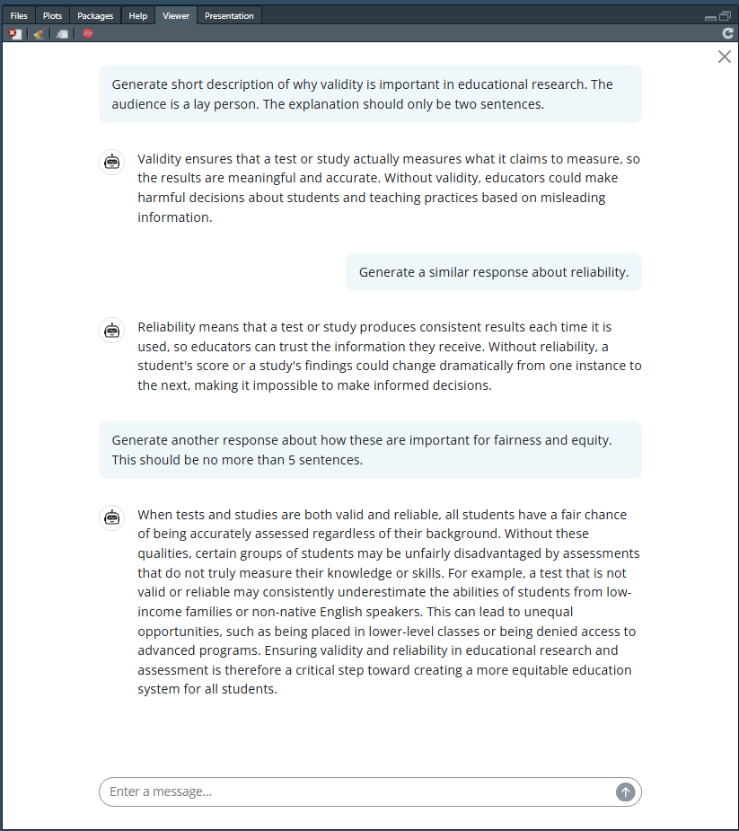

# Conversational Interactions via API

So far, we've focused on interacting with generative models in one-off interactions, where the chat history is not preserved.
This functionality differs substantially from the normal chatbot interface user experience.
These transactional interactions may not be helpful if you need to build on the same conversation over time.

There is an activity that you can download to follow along with the syntax below:
<a href="downloads/activity-conversations-via-api.Rmd" download style="display: inline-block; padding: 10px 20px; background-color: #4A90E2; color: black; text-decoration: none; border-radius: 5px;">
  📥 Download `activity-conversations-via-api.Rmd`
</a>

## Chatbot Functionality

Before diving into conversational interactions via R, it will be helpful to briefly provide more detail on how LLMs produce text in a conversation.
When a chatbot first receives your prompt, there are already a host of unseen instructions that have been provided to guide its response.
It then analyzes your prompt and, based on its training, unseen instructions, and the text it has received so far, generates the first _token_ of the response.
Then, prior to generating the next token, the process starts again, but this time the prompt to the model includes the token that was just generated. 

For example, let us say you send the prompt, "Tell me why validity is important in educational measurement in one sentence," and the model responds, "Validity is important in educational measurement because it ensures that test scores support accurate and appropriate interpretations and decisions about what students know and can do."

Although the sentence is produced almost seamlessly, this masks the internal process taking place. 
After receiving your prompt, the model evaluates the context and predicts the next token. 
(I will use words instead of token for the rest of the example to make it easier to follow.)
After going through its internal process, it may predict that the most appropriate next word is "Validity."

It then starts an autoregressive process, and the prompt effectively becomes: "Tell me why validity is important in educational measurement in one sentence; **Validity**"


From that, it may predict that the next token is "is": "Tell me why validity is important in educational measurement in one sentence; Validity **is**"


The autoregressive process starts again: the prompt is now "Tell me why validity is important in educational measurement in one sentence; Validity is" and the predicted next word is **important**.
And so on until the sentence is completed.

You may have noticed this in earlier versions of online conversational chatbots—it seemed like the model was typing out the words as it responded. 
This was not just a parlor trick or fancy UI. 
It reflected the fact that the response was being generated incrementally, token by token.

Conversational chats are similar. 
When you continue a conversation after an initial model response, the model uses the accumulated conversation history to predict the next token: your initial prompt, the model's first response, and your second prompt. 
This continues as the conversation progresses.
If you are sending your fifth prompt to the model, the model is effectively evaluating the prior conversation history—four preceding prompt-response pairs, plus your current prompt—when predicting the next token to produce.

If you need to have a conversational interaction with a model, I generally prefer using the normal online chatbot interface. It has been designed to be efficient and useful, you can access past chat histories easily, and there are other features that make interaction easier (adding tools, uploading documents or images, etc.).

However, there may be instances in which you want to have the conversation from the console, or you may only have access to a secure API that does not retain prompts or conversation history. In these instances, the [`ellmer` package](https://ellmer.tidyverse.org/){target="_blank"}, developed by Posit, offers an easy way to have conversational interactions with a variety of generative AI models.

## Conversational Interactions in R

We'll continue to use our Anthropic API key, although `ellmer` supports interactions with a variety of model providers, including OpenAI, Google Gemini, DeepSeek, Mistral, Hugging Face, and Perplexity.
What follows can _mostly_ be generalized to working with other models, with some slight differences that you can learn about by consulting the `ellmer` website linked above.

## Quick Start

The easiest way to start a conversation is just to use the default settings for a model. 
For the purposes of demonstration in our workshop, there's no need to change it, but you can find all of those details at the `ellmer` website.
You can see what Anthropic models are available with the following:

```{r anthropic available, warning = FALSE}

library(ellmer)

models_anthropic()

```

The "input" column is the cost per million tokens of model input (the prompts).
The "output" column is the cost per million tokens of the model response.
For some context, Shakespeare's _Romeo and Juliet_ is about 25,000 words, which roughly translates to 40,000 tokens (depends on the [tokenization method](@sec-tokens) of the model).
Output tokens are often more expensive than input tokens in part because generating a response is an autoregressive process: the model must repeatedly predict the next token, updating the context at each step, rather than producing the full response all at once.

```{r ellmer quick}

# Gets the API from the .Renviron file, if using this method
api_key <- Sys.getenv("ANTHROPIC_API_KEY")

# Prompts the User to enter their API key; flip for workshop
# Sys.setenv(ANTHROPIC_API_KEY = rstudioapi::askForSecret("Anthropic API Key"))

# You'll see a Claude Sonnet 4 is being used by default.
# I've included a system prompt, which we'll discuss below.
chat <- chat_anthropic(
  system_prompt = "You explain things concisely, focusing on only the most significant parts of the response.",
  model = "claude-sonnet-4-6")

```

There are two ways of using `ellmer` for conversational chats. 

## `live_console`

The first is creating a temporary `live_console`, which most resembles the functionality of the chatbot interface. 
This can be done two ways: within the R console, and by leveraging the `shinychat` package to have the interaction open in a browser (the viewer window) via `live_browser`.
Once you run the `live_console(chat)` argument, you'll notice that the console below changes to have three angle brackets (`>>>`) instead of the usual single angle bracket (`>`).
The following message also appears to help alert you that you've entered the console mode:
```
╔═══════════════════════════════╗
║ Entering chat console.        ║
║ Use """ for multi-line input. ║
║ Type 'Q' to quit.             ║
╚═══════════════════════════════╝
```

This interactivity is hard to show in a static document, so I have copied-and-pasted a short interaction below:

### `live_console` Example

```
> live_console(chat)
╔═══════════════════════════════╗
║ Entering chat console.        ║
║ Use """ for multi-line input. ║
║ Type 'Q' to quit.             ║
╚═══════════════════════════════╝
>>> Generate short description of why validity is important in educational research. The audience is a lay person. The explanation should only be two sentences.
Validity ensures that a test or study actually measures what it claims to measure, so the results are trustworthy and meaningful. Without 
validity, educators and policymakers could make important decisions about students and schools based on misleading or inaccurate information.

>>> Generate a similar response about reliability.
Reliability ensures that a test or measurement produces consistent results every time it is used, much like a scale that gives you the same 
weight each time you step on it. Without reliability, it would be impossible to know whether differences in student performance are due to 
actual learning or simply random errors in the measurement tool.

>>> Generate another response about how these are important for fairness and equity. This should be no more than 5 sentences.
When tests are both valid and reliable, all students have a fair opportunity to demonstrate their true knowledge and abilities, regardless of
their background. If a test is invalid or unreliable, certain groups of students may be unfairly disadvantaged, leading to biased outcomes in
areas like college admissions, graduation requirements, or special education placement. For example, a test that contains culturally biased 
language may not accurately measure a student's actual knowledge, but instead reflect their familiarity with a particular culture. Ensuring 
validity and reliability helps educators identify and close achievement gaps rather than create or reinforce them. Ultimately, valid and 
reliable assessments are essential tools for building an educational system that treats every student with fairness and equity.

>>> Q

```


### `live_browser` demo

Alternatively, by also using the `shiny` and `shinychat` packages, you have have the same interaction appear in your "Viewer" window of the R Studio screen.
One you have provided your API key and set the initial `chat` details (as above), you the execute the following:

```{r, eval = FALSE}

live_browser(chat)

```

```
╔═══════════════════════════╗
║ Entering interactive chat ║
║ Press Ctrl+C to quit.     ║
╚═══════════════════════════╝
```

Here is a screenshot of part of an interaction:

{fig-align="center"}


## Interactive method call

Now let's look at the second method for conversational chats, the interactive call method.
Below I've prompted the model via `chat$chat("prompt")`, and then immediately used the same syntax again (with a different prompt).
I've hidden the output because it's so long; you'll need to click to see the prompt and model response.

::: {.callout-note collapse="true"}

## Click to see first prompt and response

```{r eq 1}
chat$set_turns(list())
chat$chat("Tell me about the history of the exploration of the moon")
```

:::

::: {.callout-note collapse="true"}

## Click to see follow-up prompt and response


```{r eq 2}
chat$chat("What are the most important non-USA exploration missions?")
```

:::

As you can see, the second response from the model takes into context the first prompt - it's still talking about the moon!
This conversational functionality is useful when you're doing iterative development or planning, as the previous calls to the model are important for providing content and building upon previous prompts and model responses.

## `chat_anthropic` Details

Let's look at the details of `chat_anthropic` (from [this page of the `ellmer` package reference.](https://ellmer.tidyverse.org/reference/chat_anthropic.html))

```{r, eval = FALSE}

chat_anthropic(
  system_prompt = NULL,
  params = NULL,
  model = NULL,
  cache = c("5m", "1h", "none"),
  api_args = list(),
  base_url = "https://api.anthropic.com/v1",
  beta_headers = character(),
  api_key = NULL,
  credentials = NULL,
  api_headers = character(),
  echo = NULL
)

```

It's important to note the `params` argument, which allows you to set a variety of model parameters when chatting with the model.
This is a [general argument](https://ellmer.tidyverse.org/reference/params.html) in the `ellmer` package. 
You'll need to ensure that your model input allows a specific generation parameter before including it in your call.

This is one place where having a conversation with a model via API instead of via a chatbot interface is different - it's not always easy (and sometimes impossible) to change these parameters in the normal chat interface.

```{r, eval = FALSE}

params(
  temperature = NULL,
  top_p = NULL,
  top_k = NULL,
  frequency_penalty = NULL,
  presence_penalty = NULL,
  seed = NULL,
  max_tokens = NULL,
  log_probs = NULL,
  stop_sequences = NULL,
  reasoning_effort = NULL,
  reasoning_tokens = NULL,
  ...
)

```

### Options for Clearing the Chat

There are two methods to reset the chat history. when you're using the interactive call method.
This is useful when you want to start a conversation about another topic.

#### Clearing While Maintaining Chat Configuration

The following syntax simply clears the turns but maintains the other aspects of the chat configuration (which we'll discuss momentarily). 
In the background the `ellmer` package is saving a history of your prompts and model responses, and it sending this history as part of the prompt when you send a new prompt.
This is also happens when having a conversation with a chatbot, but it's even less obvious.

```{r, eval = FALSE}

chat$set_turns(list())

```

#### Clearing All Chat Settings

This starts an entirely new chat with the Anthropic model, and removes any settings you've made (system prompt, parameters).
You can also include this in your argument - the important part is that using `chat_anthropic()` again resets any previously-specified chat configuration.

```{r, eval = FALSE}

chat <- chat_anthoropic()

```

### Retaining the Chat History

As you interact with a generative AI model through `ellmer`, a record of your prompts and model responses are stored in `chat$get_turns()`.
When you examine this list object, each odd-numbered entry (starting with 1) are your prompts, and each even-numbered entry is the model response.

::: {.callout-note collapse="true"}

## Click to see an example of saving the chat history.

```{r chat hist, eval = FALSE}

chat <- chat_anthropic()
chat$chat("Give me a 5-sentence history of educational measurement.")
chat$chat("Give me a 5-sentence summary of educational measurement breakthroughs since 2000.")

ed_meas_chat <- chat$get_turns()
save(ed_meas_chat, file = "./data/ed_meas_chat.Rdata")

```
```{r view chat hist}

load("data/ed_meas_chat.Rdata")
ed_meas_chat[1]
ed_meas_chat[2]
ed_meas_chat[3]
ed_meas_chat[4]

```

:::
---

## System Prompts

We briefly discussed system prompts in the [section about generative parameters ](08-gen-ai-parameters.qmd#sec-system-prompt).
The system prompt is an instruction to the model that is maintained throughout all of your interactions with the model.
I don't generally use system prompts when calling models via API, but I probably should.
😅
Nonetheless, let's see how changing the system prompt can change the model output.

First, with no setting of the system prompt:

```{r no system prompt}

chat <- chat_anthropic()

chat$chat("Briefly tell me the point of using a Rasch model.")

## rano <- as.character(rasch_normal)


```

---

Now using a playful system prompt:

```{r playful system prompt}

chat <- chat_anthropic(
  system_prompt = "You are an assistant that likes to respond in rhymes."
)

chat$chat("Briefly tell me the point of using a Rasch model.")

```

---

Some more helpful examples of good system prompts are:

- **Specifying Output Structure**
  - "Always respond in JSON format with keys: 'answer', 'confidence', 'sources'. 
  Never include any text outside the JSON object."
- **Setting Constraints**
  - "You are a medical information assistant. Always:
  1. Emphasize you're not a doctor
  2. Recommend consulting healthcare professionals
  3. Cite medical sources when possible
  4. Never diagnose conditions"
  
### Retaining the Chat History with the System Prompt

The system prompt is also retained in the chat history, and can be accessed by specifying `chat$get_turns(include_system_prompt = TRUE)`.
The list object now has the system prompt as the first object, meaning that your prompts are now every even-numbered object, and the system responses are every odd-numbered object, started at 3.

::: {.callout-note collapse="true"}

## Click to see an example of saving the chat history with the system prompt.

```{r chat hist w system, eval = FALSE}

chat <- chat_anthropic("You respond only with the 5 most important sentences about a topic.")
chat$chat("Give me a summary of the history of educational measurement.")
chat$chat("Give me a summary of educational measurement breakthroughs since 2000.")

ed_meas_chat_wsp <- chat$get_turns(include_system_prompt = TRUE)
save(ed_meas_chat_wsp, file = "./data/ed_meas_chat_wsp.Rdata")

```
```{r view chat hist w system}

load("data/ed_meas_chat_wsp.Rdata")
ed_meas_chat_wsp[1]
ed_meas_chat_wsp[2]
ed_meas_chat_wsp[3]
ed_meas_chat_wsp[4]
ed_meas_chat_wsp[5]

```

:::

